import RailM from '../../components/RailM.astro';
import RailFullM from '../../components/RailFullM.astro';
import ImgGrid from '../../components/ImgGrid.astro';
import ImgLazyDisplay from '../../components/ImgLazyDisplay.astro';

import img1 from "../../assets/blog/20231231/R0005374.JPG"

もう2023年も終わる。早い。なので今年買ったものでよかったものをまとめる。  

## マムートのマウンテンパーカ  

<RailFullM>
  {/* 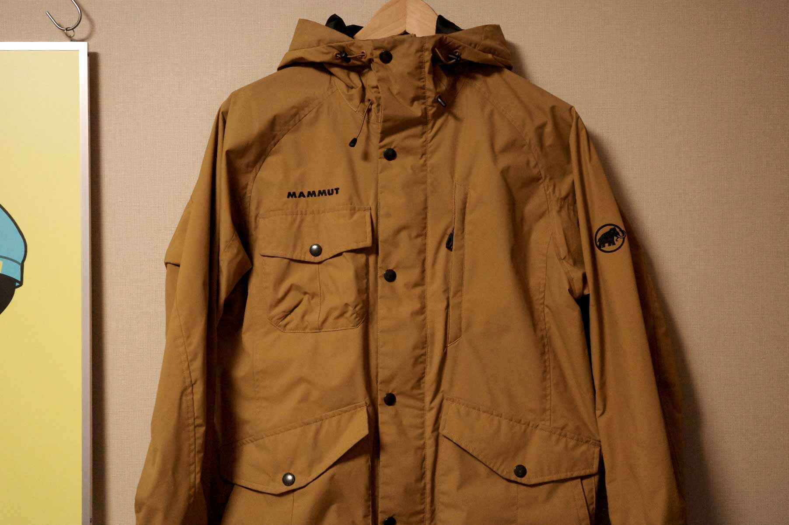 */}
  

マムートのマウンテンパーカ。色合いが良い

</RailFullM>

北海道ツーリングに合わせて買った。  

防風性能と透湿性能、速乾性能の高さが長旅でとても役に立った。見た目より防寒性能も高く、秋しか使えないかと思っていたが中に着る物を調整すれば冬でも普通に使えて驚いた。しかもめっちゃ軽くて負担にならない。知る限り他のマウンテンパーカーよりだいぶ細身で、オートバイでもバタつかない。それでもインナープロテクターをつけれる余裕はある。総じてオートバイ、アウトドアの疲労をかなり抑えてくれる。  

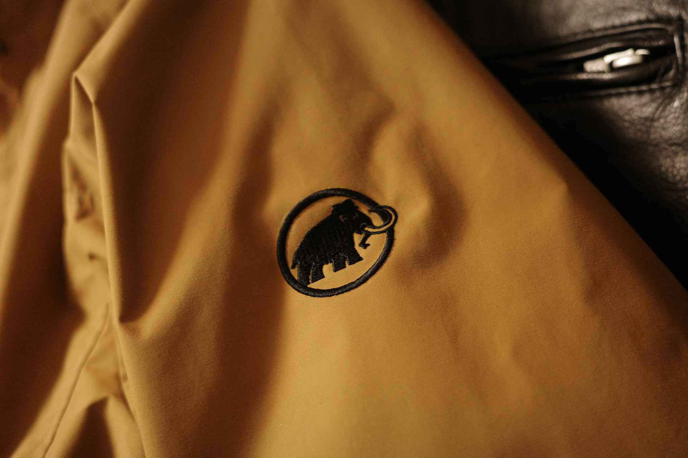

ロゴがかわいい

個人的な好みだが色がいい。目立つ色でありながらも安っぽくない絶妙な色だと思う。  

どんな場面でも役立つので、思っていたよりだいぶ高頻度で着ている。  

## The corona utilityのEPICナイロンジャケット  

<RailFullM>
  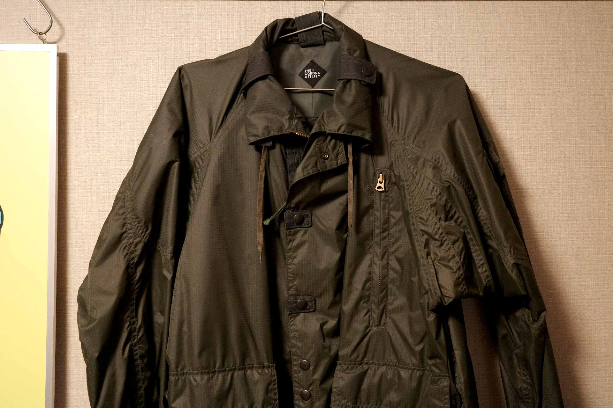

The corona utilityのEPICナイロンジャケット

</RailFullM>

高い防水性、防風性、透湿性の高さと羽根のような軽さが特徴。  
EPICという生地は、アメリカのNEXTEC社の開発するハイテク素材で、ゴアテックスのようなコーティングではなく、繊維の内側にシリコンバリアを施すことで生地の構造自体が水を弾く。なので洗濯に気を使わないし劣化しづらい。春夏で活躍した。  

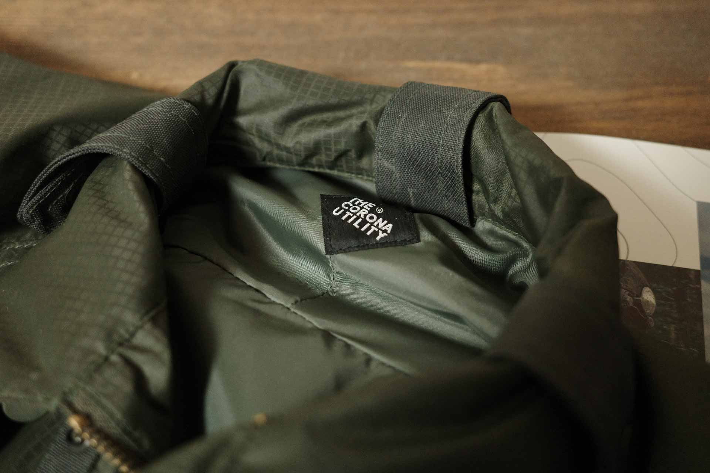

テントの素材にちょっと似た質感と手触り

見た目がほどよくミリタリーっぽくていい。コテコテのミリタリーはよりこれくらいがちょうどよい。ゆったり着れる。  

## DDタープ3.5m×3.5m  

3年以上DDタープの3m×3mを使っていたがざっくり破いてしまったので購入。  

DDタープは元々お気に入りのキャンプギアで、知らない人にざっくり説明すると、頂点や四辺などあらゆるところにループの付いた正方形の布。工夫次第で環境を選ばない変幻自在な設営ができ、これとポールとコットさえあれば野営できたで、キャンプでも長旅でも大変重宝していた。  

3x3でのタープ泊でも不満なく使えていたが、室内がもう少し広いと楽だなと思っていたでの、これを機に少し大きいのを買った。広さはやはり正義。とても快適だった。  

<RailFullM>
  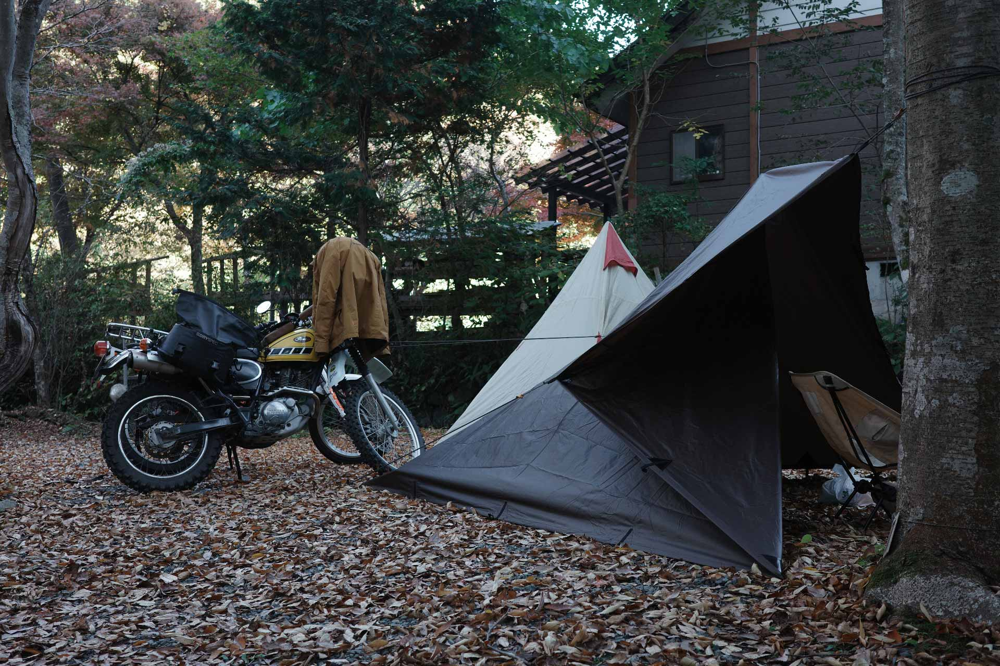

3.5mの設営イメージ

</RailFullM>

この大きさならオートバイへの積載や収納も面倒にならない。4x4だとデカすぎてきついかもしれない。  

## 少女発動機 MOTORED CYBORG RUNNER アクションフィギュア  

内燃機関と走るための機構、そして美少女と好きな要素がこれでもかと詰めこまれたアクションフィギュア。  

<RailFullM>
  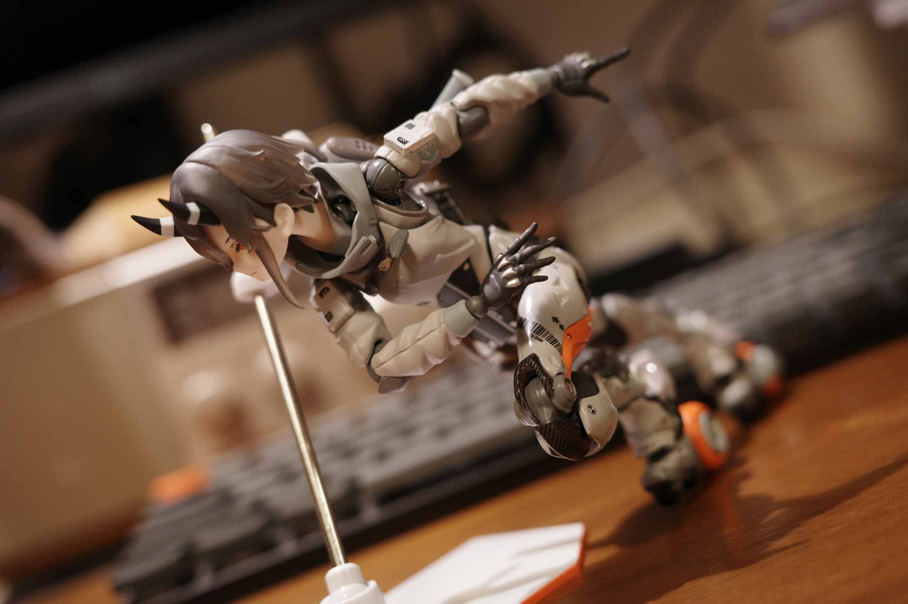

MOTORED CYBORG RUNNERの名の通りのルックス

</RailFullM>

もともとは敬愛するイラストレーター、AF_KURO氏が世界観を構築するイラストレーション作品群で、それをご本人がそのままフィギュアとして企画したもの。元プロダクトデザイナーであった氏の描くイラストは意図の塊であり、現実のオートバイをはじめとするプロダクトデザインの文脈から来る説得力とリアリティに裏付けされたルックスが抜群にかっこいい。  

可動域の広さのおかげでやりたいかっこいいポーズは大体取れる。永遠に遊べる。 楽しい。  

<RailM>
  <ImgGrid>
    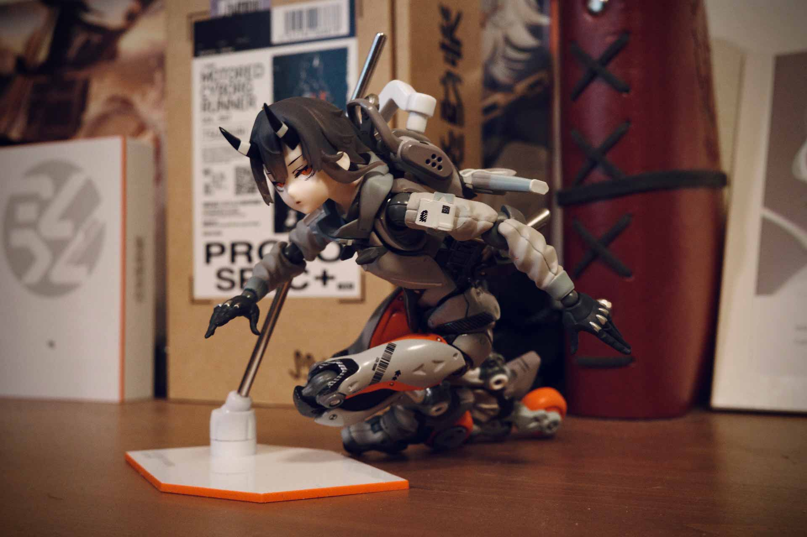

    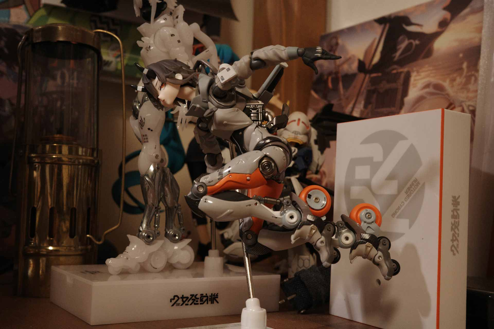
  </ImgGrid>
  
プレイバリューが高い。

</RailM>

他のモデルも出たら買うと思う。今後も楽しみだ。  

## Northlineのバックステップ  

メインマシンのSvartpilen701のためバックステップ。  

<RailFullM>
  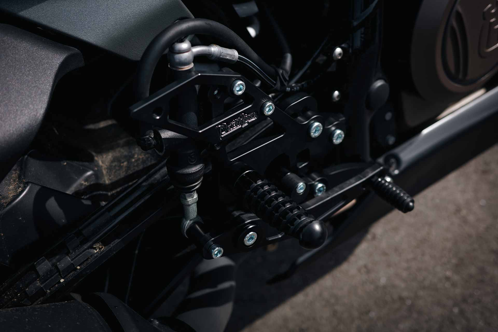

もともとVitpilen701用だったらしい。そのまま付いてよかった

</RailFullM>

ノーマルステップはシートから距離があり、膝の曲がりが足りず、荷重がかけにくかった。オートバイは全身で重心を動かして操作する乗り物。ポジションはとても大事。  

これでポジションを調整した結果、荷重がかけやすくなり、加速時も踏ん張りが効き、不要な力をかける必要がなくなったので疲れなくなった。  

Northlineさんは昔から少し付き合いがあって、大阪に行った際にお店にお邪魔して直接フィッティングしてもらった。調整幅が広く、自分に合った膝の位置がバッチリ出る。ありがとうございました。  

## 髭トリマー  

<RailFullM>
  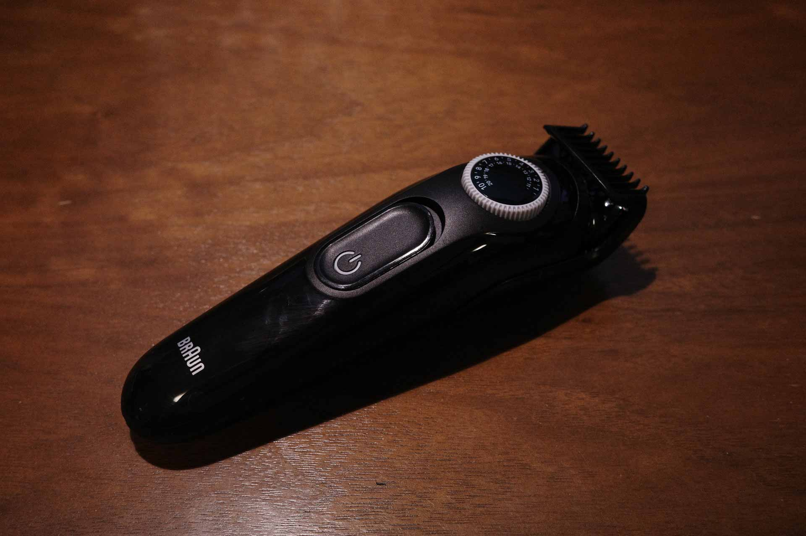

ダイヤルで直感的に長さを設定できる

</RailFullM>

青髭に悩まされ続けた私は、もう剃って青くなるより貴重な資源を活かそうと思い、ヒゲを伸ばしはじめた。  

それまでハサミでなんとか整えてたけどめんどくさすぎるし、ヒゲ初心者にはハサミで形を整えるのは敷居が高いと思って買った。  

長さを結構幅広く決められるのがいい。だいぶ楽になった。ついでにもみあげなど整えるのにも使える。  

## FOXのボディプロテクター  

林道やオフロードコースに行くために購入。  

オフロードではプロテクターは必須。胸部は命に直結する。オートバイ詳しくない人に向けて説明すると、胸にハンドルを強打したり、走行中に胸に木の枝が刺さったり、横に転倒した時に肘が脇腹を強打して肋を折ったり、そういうことを防いでくれる。  

<RailFullM>
  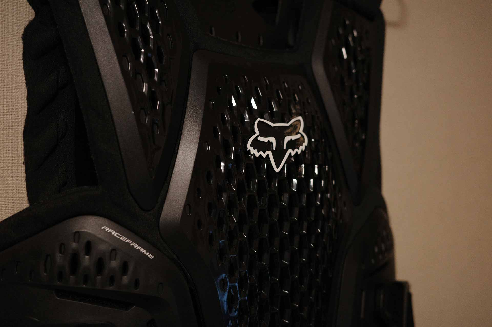

通気性も見た目よりいい

</RailFullM>

このプロテクターのいいところは、他のモデルよりスリムで装着感が薄いところ。いろんなものの下に着れるし、動きを阻害する感じがない。  

林道レベルだとこれくらいでいいと思う。  

## D3Oプロテクター  
直接手足につけるタイプのプロテクター。春夏用のプロテクター付きのウェアが好きになれず、好きなウェアの下につけるために買った。  

<RailFullM>
  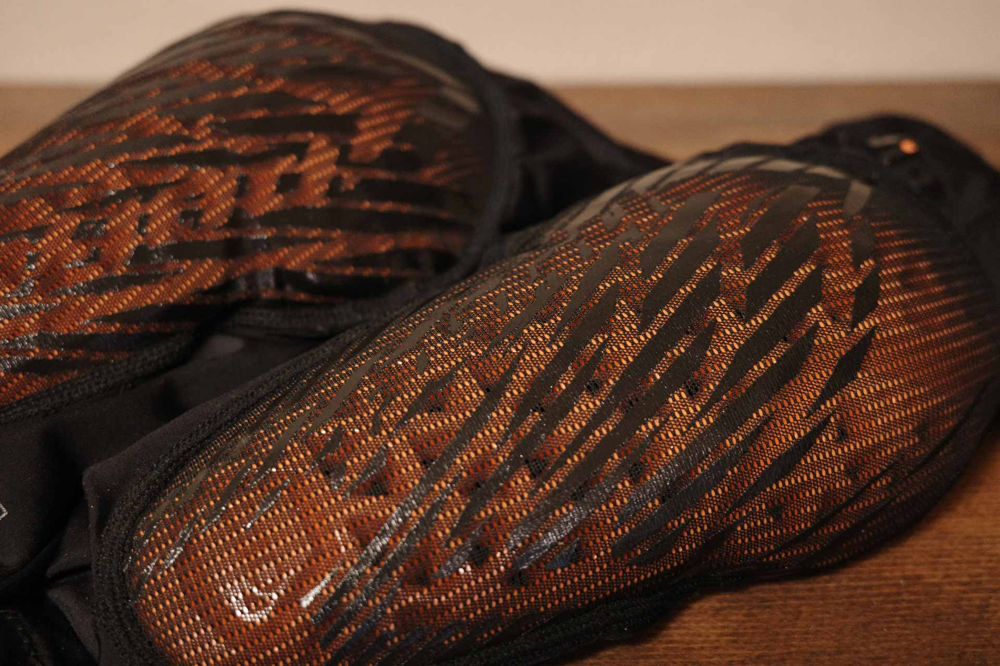

柔らかいが、衝撃が加わると固くなる

</RailFullM>

D3Oは衝撃が加わった瞬間のみ固くなる特殊素材。なので普段は柔らかく、装着感が全くない。動きやすくてとてもいい。ちょっと蒸れやすいのが欠点だが、楽に洗えるし冬は暖かいのであまり気にしてない。  

他のプロテクターよりちょっと高価だが、それに見合った快適性を提供してくれる。  

オフロード用の固くてカバー範囲の広いプロテクターも持っているが、こちらは舗装路やフラットなダートなどライトに乗りたい時に使う。  

## エンデュリスタントルネード2Lドラムバッグ  
たくさんの荷物をひとまとめにしてオフロードバイクのキャリアに載せるために購入。  

Svartpilen701には小分けにして合体させられるバッグを使っていた。（というか車両構造上それしか使えない）が、ブロンコにはキャリアがあるのでほぼこちら専用。  

<RailFullM>
  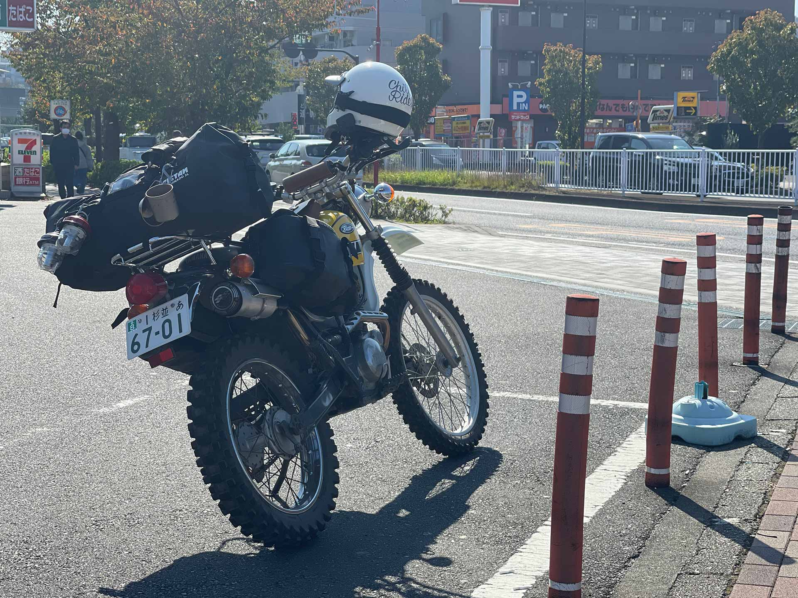

キャリアに乗っているのがそれ。結構でかい

</RailFullM>

分割するバッグはでかいものを入れられない欠点があったが、これには問題なく入るので雑にパッキングできるのがいい。  

完全防水で積載もしやすい設計、主張の少ない見た目がいい。  

この手のフレームのないバッグは中身が少ないと積載難度が上がる。なのでぶっちゃけMサイズもほしい。  

## ARMORED CORE VI FIRES OF RUBICON  
我々は10年待ったのだ。  

前作から10年、青春時代を捧げたゲームシリーズの待望の最新作。発表のPVを見た段階でガチで泣いてしまったレベル。  

<RailFullM>
  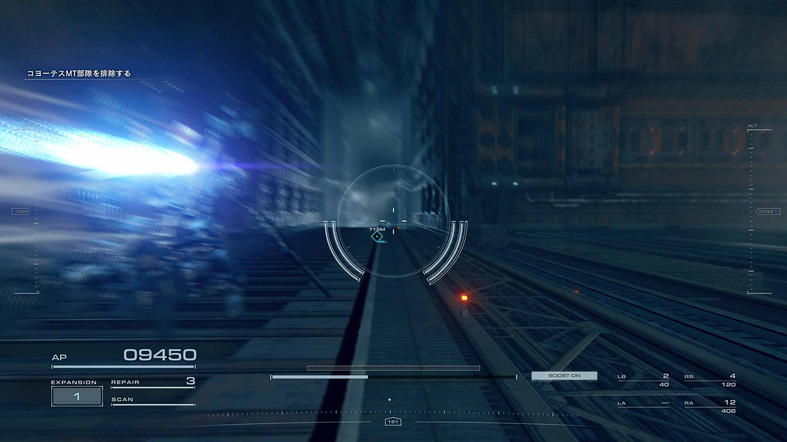

プレイ画面

</RailFullM>

自分のやりたい戦闘スタイルや見た目の好みに合わせてパーツを組み合わせ、オリジナルの機体を作る、という根幹のシステムを踏襲しつつ、過去作で追加された要素を大胆にそぎ落とし、原点回帰している。  

個人的にはシングルプレイ重視の作りなのが特によかった。前作はPS3だったので、「俺が考えた最強にカッコイイマシン」をぐりぐり動かすアーマード・コア本来の体験を高画質、高フレームレートで味わえるのが最高に良かった。  

<RailM>
  <ImgGrid>
    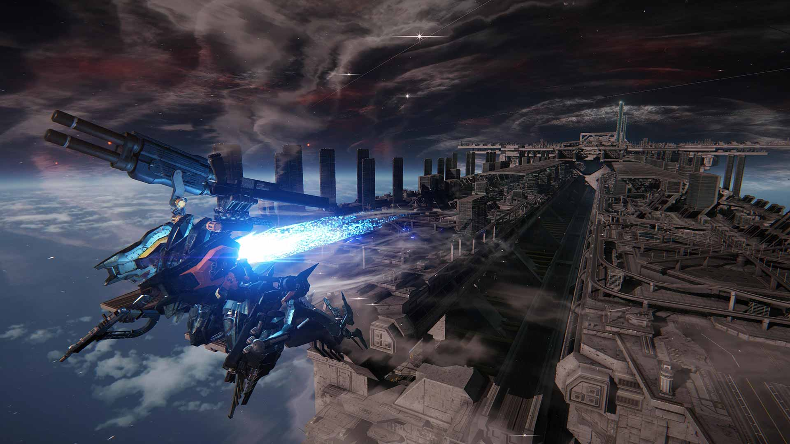

    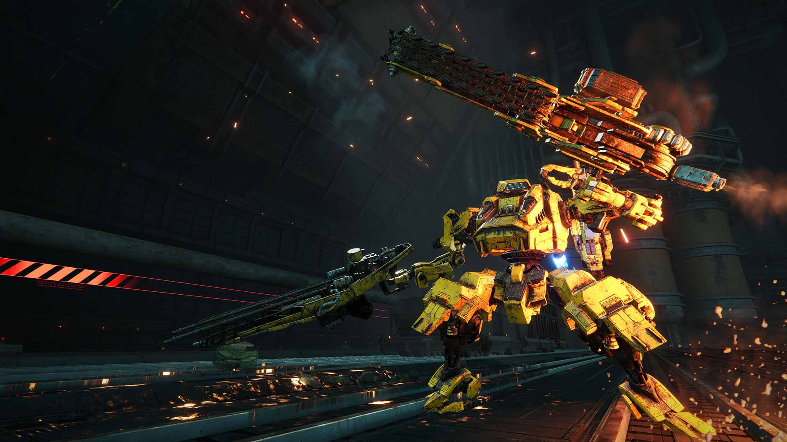

    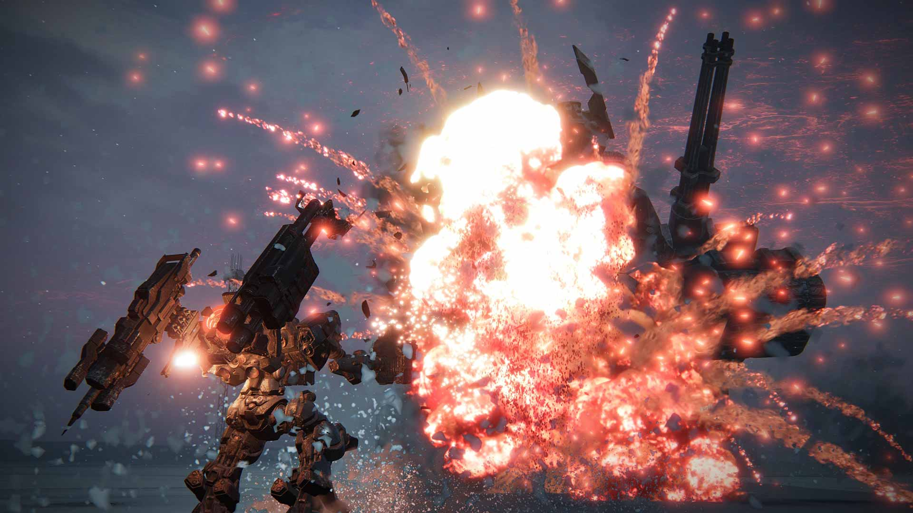

    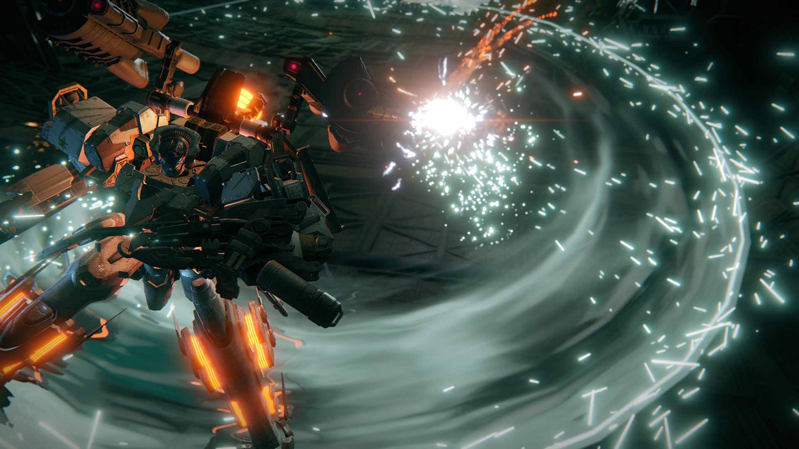
  </ImgGrid>
  
フォトモードも楽しい

</RailM>

そして長年待ったファンへの熱いメッセージとも取れるストーリー文脈に泣かされてしまった。過去作よりもネットでの盛り上がりも高かったので、また続編を楽しみにしたい。  

## 総評と来年  

生活のものより趣味のものの方が多かった。来年はQOLを上げてくれるものを買おう。特に椅子。腰の負担が限界を超えそうなのでいい椅子を買いたい。
