import RailM from '../../components/RailM.astro';
import ImgGrid from '../../components/ImgGrid.astro';

新型Svartpilen801が発表された今だからこそ、愛車のSvartpilen701について語りたいと思う。  

私はこれの兄妹車であるVitpilen701のコンセプトモデルが発表された当時、大変衝撃を受けた。そのミニマルで洗練されたルックスは、モチーフはクラシックオートバイの文脈上にありながら、今までにない新しさを持っていた。英国オートバイ文化から世界に波及したいわゆる「カフェレーサー」の文脈でデザインされたそのオートバイは、コンセプトモデルから大きく変わることなく市販化され、その後同じコンポーネントを用いつつ一部に変更を加えていわゆる「フラットトラックレーサー」文脈のルックスに仕立てたSvartpilen701が発売された。  

<RailM>
  <ImgGrid>
  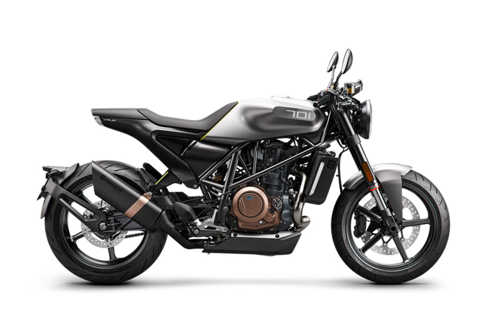  

  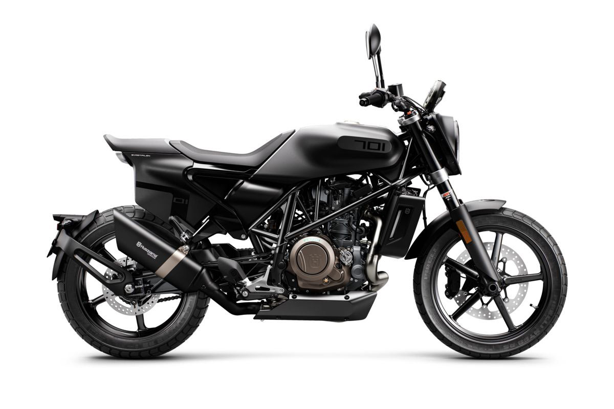  
  </ImgGrid>
  
左：Vitpilen701と右：Svartpilen701。 出典：Husqvarna Motorcycles

</RailM>

このオートバイは、他のネオクラシック（現代的な性能と装備を持ちつつルック＆フィールを往年のスタイルにまとめたオートバイ）とは造形のアプローチが根本的に異なるのが印象的だった。  

そこから数年後、私は最終的に2020年末にSvartpilen701を購入することになるが、それまでこの2台のデザイン文脈、そしてHusqvarna Motorcyclesの歴史について日常的に調べていた。このオートバイのデザインを語る前提として、その歴史について触れる。  

## Husqvarna motorcyclesというブランド

Husqvarna motorcyclesのロゴ

Husqvarnaという企業の歴史は長く、その始まりは300年以上前に遡る。元々はマスケット銃のメーカーとしてスウェーデンで始まる。その名残が企業ロゴから見て取れる（マスケット銃の銃口の形）。オートバイの製造は1903年から始まり、オフロードバイクレースで活躍する欧州有数のオートバイメーカーとなる。1950年代、Husqvarnaのオートバイを象徴するモデルがSilverpilen（銀の矢）だ。それはブランド初の量産オフロード競技バイクであり、軽量でハイパワーなパフォーマンスは人気を博したそうだ。

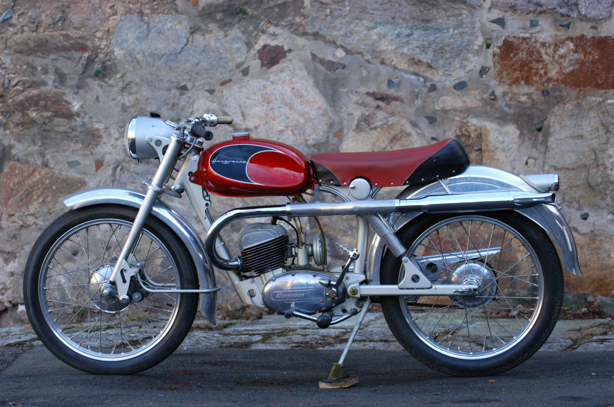

Silverpilen 出典：[Husqvarna motorcycles : The silver arrow - Episode 2](https://www.husqvarna-motorcycles.com/ja-jp/Good-old-times/the-silver-arrow---episode-2.html)

Silverpilenは、スウェーデンのインダストリアルデザイナー、[シクステン・セゾン](https://ja.wikipedia.org/wiki/%E3%82%B7%E3%82%AF%E3%82%B9%E3%83%86%E3%83%B3%E3%83%BB%E3%82%BB%E3%82%BE%E3%83%B3)がデザインを手掛けている。元々SAABの航空技師だった彼は、第二次大戦後のSAABの自動車のみならずHusqvarna、ハッセルブラッドなどの民生品のデザインを手掛けている。そのマシンの「美しくシンプルで、美しく削ぎ落とされた」機能美、いわゆるスカンジナヴィアデザイン哲学をHusqvarnaとセゾンのSliverpilenは体現していた。  

その後、二輪車部門はHusqvarna Motorcyclesとして1986年にカジバに売却されると、一部エンジニアが退職、Husaberg（フサベル）というメーカーを立ち上げる。そのHusabergは1995年にKTM傘下に入るが、Husqvarna MotorcyclesもBMW傘下を経て2013年にKTM傘下となる。KTMグループの下でHusqvarna Motorcyclesとして再び一つのブランドに統合され、その象徴たるかつての名車Silverpilenのコンセプトを現代的な解釈で蘇らせようとしたモデルが、Vitpilen, Svartpilen（白い矢、黒い矢）である。  

## KISKAによるリブランディングとネオクラシックへの解釈  

KTMグループの製品含めたブランドデザインを一手に引き受ける[KISKA](https://kiska.com/)は、「PIONEERING SINCE 1903」というHusquvarna mortorcyclesの歴史あるブランド体験全体を前進させるため、そのバックグラウンドであるモトクロスの伝統を都市生活向けに再解釈。過去の精神をそのままに革新性と未来志向を強調する「PIONEERING、PREMIUM、SWEDISH ROOTS」という新たなブランドバリューを定義した。新規ユーザー層を獲得するために新たなオートバイライフスタイルを想起させ、感情を揺さぶるための入り口として、美しくシンプルで美しく削減されたSilverpilenのコンセプトに現代的な解釈と現代的な設計手法を組み合わせた。  

それはコアユーザーとしてターゲットした自らのスタイルにこだわりと探究心を持つミレニアル世代の感情に訴えかけ、オフロードをルーツに持つブランドが都市空間における新たなオートバイライフスタイルに誘うためのデザインだった。250ccクラス相当の軽量な車体とパワフルかつスムーズな693cc単気筒エンジンに最低限の電子制御装備を組み合わせ、それらを現代的なラインと人間工学に基づいた形状が特徴的なミニマルなルックスで表現したマシンはクラシックの文脈に乗りながらも新しく刺激的なものであった。  

私はそのブランドのストーリーから復活したコンセプトとその回答の美しさに惹かれた。かくいう私もミレニアル世代の人間なので正にその思惑通りに撃ち抜かれてしまった。  

## 他とは異なるネオクラシックへの回答  

このVitpilen, Svartpilenは、他のメーカーのネオクラシックモデルとは造形のアプローチが根本的に異なるように見える。  

 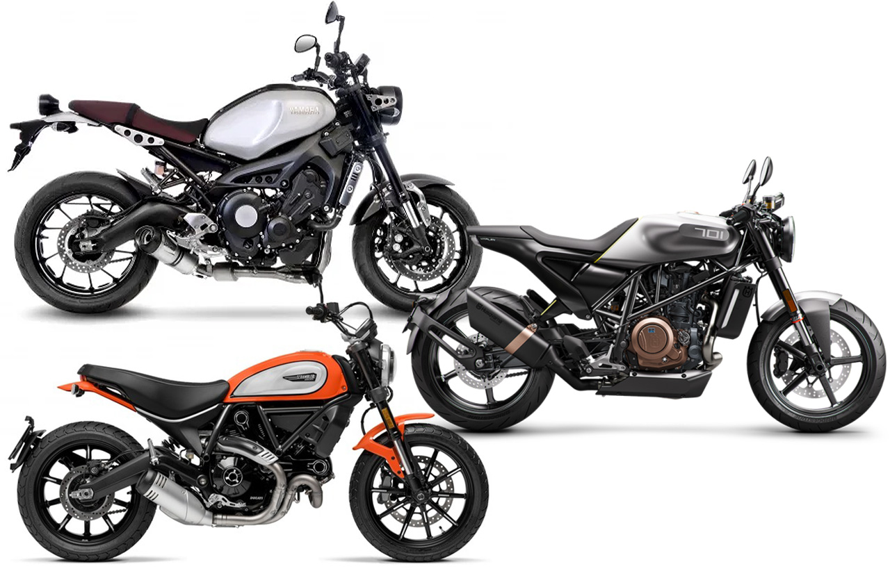

他メーカーモデルとの比較。YAMAHA XSR900, Ducati Scrambler, Vitpilen701。いずれも現代の車体・エンジンに対してクラシックオートバイからインスピレーションを受けた造形をしているが、ルック&フィールは異なる。

他のメーカーのネオクラシックは、フレーム・エンジン・車体バランスは現代的ながら、各所の丸みを帯びたコンポーネント形状やボルト留めなどのディティールに至るまでレトロな印象を与える意匠を施していたり、往年の名車のルックスを再現するようなアプローチが見受けられる。

<RailM>
  <ImgGrid>
  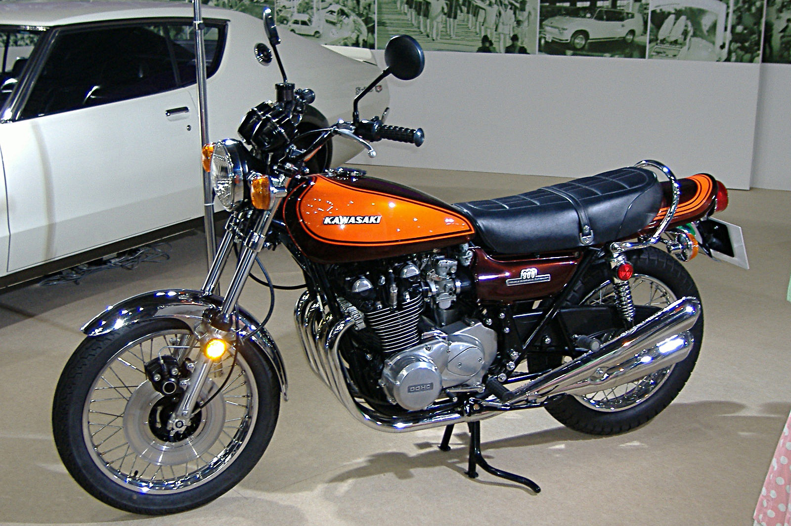

  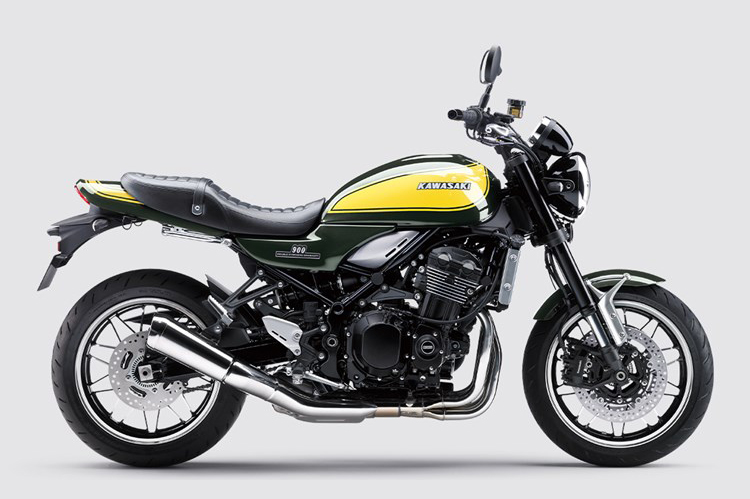
  </ImgGrid>
  
KAWASAKI Z1とそのルックスを現代の車体とエンジンで再現したZ900RS

</RailM>

対してHusqvarna motorcyclesのVitpilen,Svartpilenは、全体はベース車両の690Dukeのフレームを起点にしつつあらゆるコンポーネント同士のラインが揃うような造形で、極限までディティールをそぎ落としながらも象徴となるクラシックなモチーフはところどころ削ぎ落とされた形で残っており、フレーム含む車体設計を尊重しつつも全体像から確かにネオクラシックの文脈にあることを理解させる姿にまとまっている。  

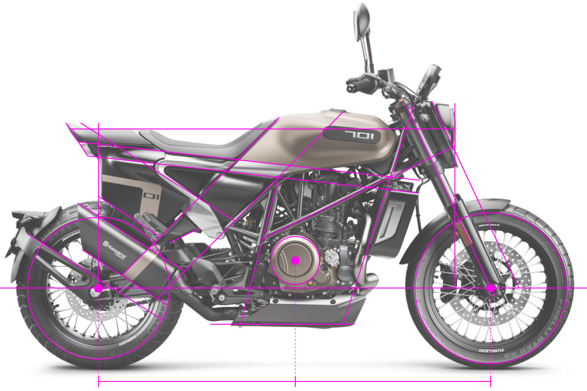

Svartpilen701にガイド線を引いた図。各コンポーネントが特定のラインに沿うように造形・レイアウトされ、秩序を持たせている。

<RailM>
  <ImgGrid>
  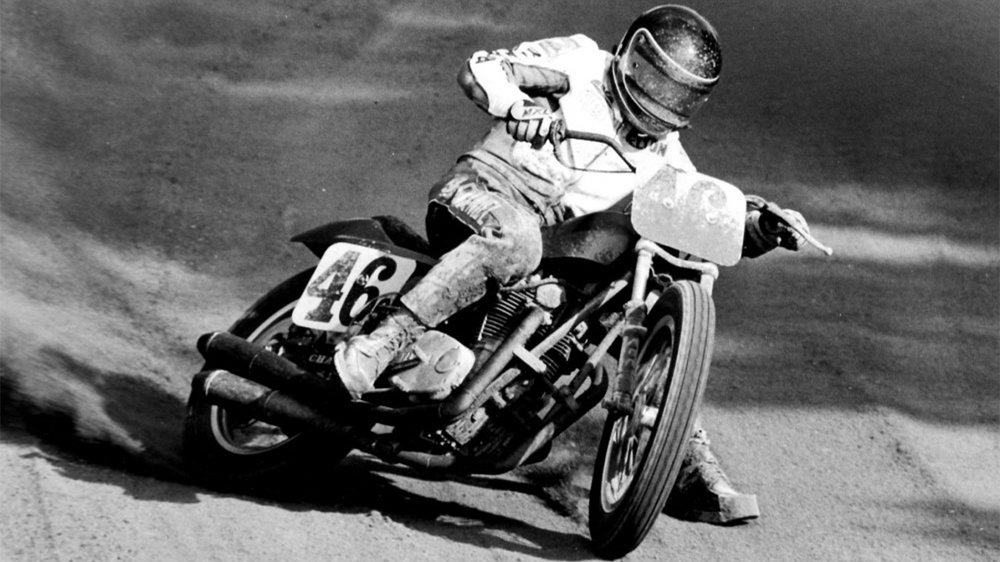

  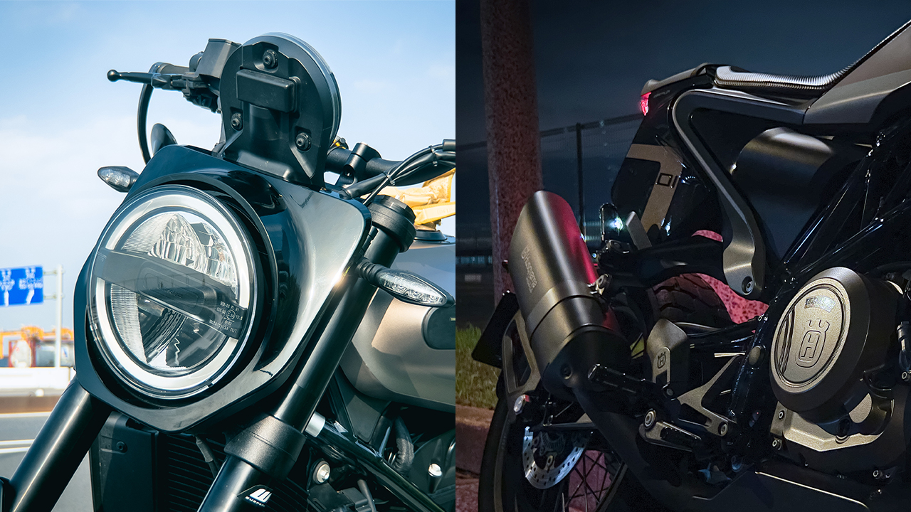
  </ImgGrid>
</RailM>

伝統的なフラットトラックレーサーとSvartpilen701の造形。ディテールを省いたシンプルな造形だが、クラシックフラットトラックレーサーの特徴であるゼッケンプレートからインスピレーションを得た造形が見て取れる。これらだけで充分クラシック文脈上にあることを伝えられている。

> “There have been a lot of interpretations of classic bikes in the market lately,”（中略）“But Husqvarna was always pioneering, and we wanted to be forward-thinking, not just harkening back to the past. Where others have tried to do retro design on their bikes, we wanted to be cutting edge, superminimalistic, and really progressive in our approach but still have this simplicity that the products back then had.”  
> 最近、市場にはクラシックバイクの解釈が数多く出回っています。（中略）しかし、ハスクバーナは常にパイオニアであり、過去を懐かしむだけでなく、先進的でありたかった。他のメーカーがレトロなデザインのバイクを作ろうとするなか、私たちは最先端、超ミニマム、そして先進的なアプローチでありながら、当時の製品が持っていたようなシンプルさを残したかったのです。  

引用元：[AUTODESK](https://www.autodesk.com/customer-stories/kiska-motorcycle-design)

とKISKAのデザイン責任者であるクレイグ・デント氏は述べる。  

オートバイのデザインはブランド体験全体のデザインの一部を構成するとともに、見える範囲のほとんどが機能部品かつ身体が触れ、操縦に影響を及ぼす領域が大半を占める。それは機上の人間の運動・操作をサポートする形でありながら、顧客に利用シーンを想起させる美しい造形に落とし込まなければならないことを意味する。さらには、社会インフラである公道で走行するための要件や責任をクリアしなければならない。ただハイパフォーマンスで美しいだけでは公道を走るプロダクトとして成立しない。それはとても難しい仕事だ。世のオートバイエンジニア・デザイナーに敬意を表さずにはいられない。  

私は今まで見たことがなかったそのルックスにすっかり虜になった。このオートバイに対するルックアンドフィールにおいて、オートバイに明るくない人は「未来的」と評し、詳しい人ほど「レトロ」と評したのが印象的だった。まさにデザイナーの思惑通りの結果に驚かされた。  

いざ走り出してみればレスポンスの良いエンジンに軽量な車体とスリムな形状が、他のオートバイで経験したことのない楽しさを提供してくれた。現在4万キロほど走ったところだが、飽きる気配はない。

## 6年ぶりに再解釈される新しい矢  

<RailM>
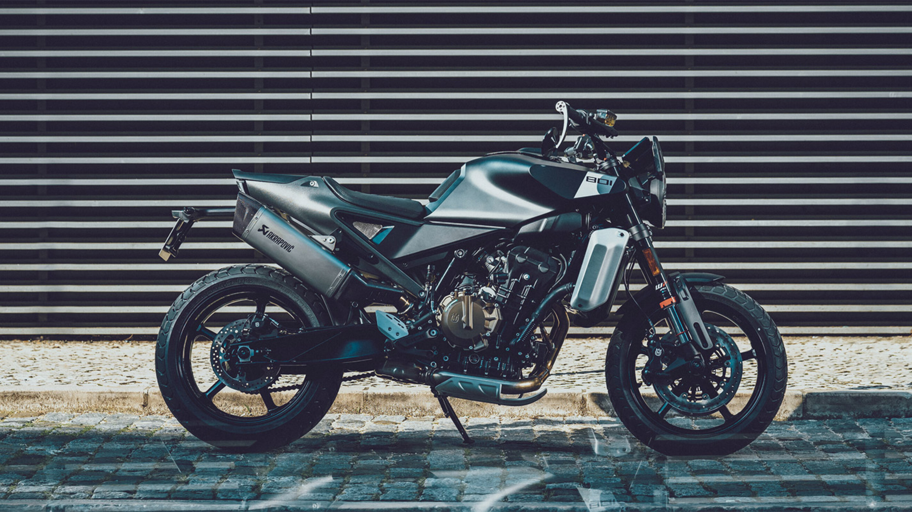

Husqvarna motorcycles Svartpilen801 出典：[Husqvarna motorcycles](https://www.husqvarna-motorcycles.com/ja-jp/models/naked/svartpilen/svartpilen-801-2024.html)

</RailM>

そんなVit, Svartpilenシリーズも、中型モデル共々装い新たにフルモデルチェンジした。賛否あると思うが、ここまで語ってきたような哲学は確実に受け継がれていると感じる。あとはルック&フィールが好みであるかどうかの問題しかない。もしかしたら、ミレニアル世代からさらに先のターゲットを見据えた進化なのかもしれない。だとしたら、自分に刺さらないのも当然である。なぜならHusqvarna motorcyclesは前途の通り常に過去に学び革新性と未来志向を強調しているのだから。  

それと同時に、私が2020年当時に、このSvartpilen701が今世界で最も美しいオートバイにあるに違いないと感じた気持ちは今でも変わっていない。それはこれまで述べた成り立ちや哲学含めて。  

少なくとも、このようなコンセプトのオートバイが一代で終わらずにモデルチェンジを迎え、進化していることがとても嬉しく思う。この先もその哲学に惹かれ続けるだろうと思う。  

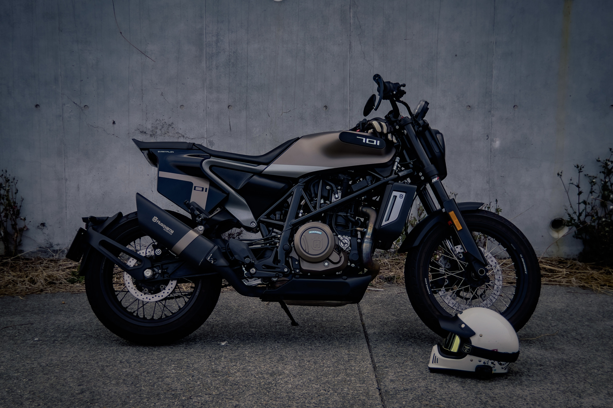

私のSvartpilen701

## 参考文献
- AOTODESK：[How to bring a classic motorcycle design back to life
](https://www.autodesk.com/customer-stories/kiska-motorcycle-design)  

- KISKA：[A new gateway to motorcycle culture.](https://kiska.com/work/husqvarna-motorcycles/)