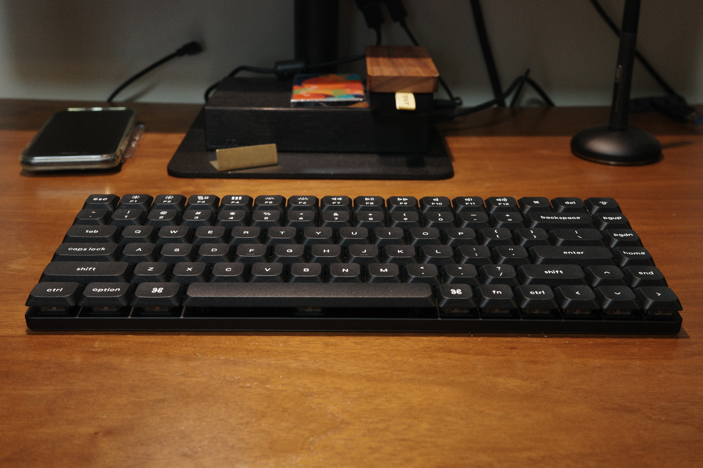
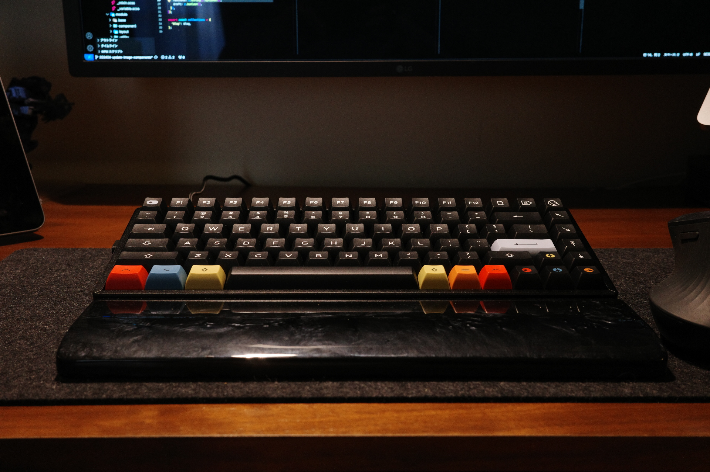
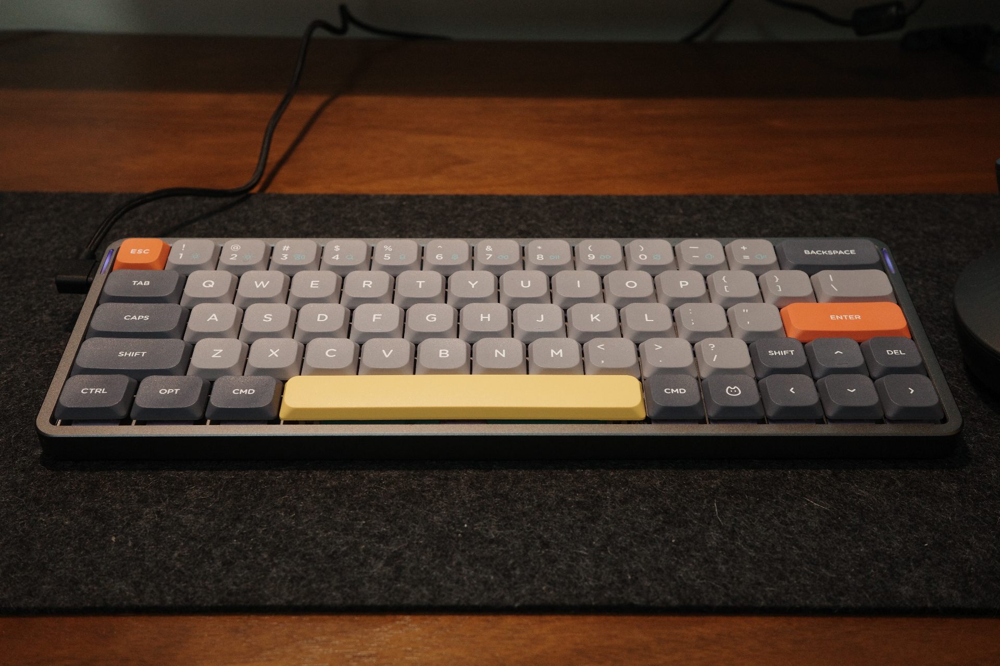
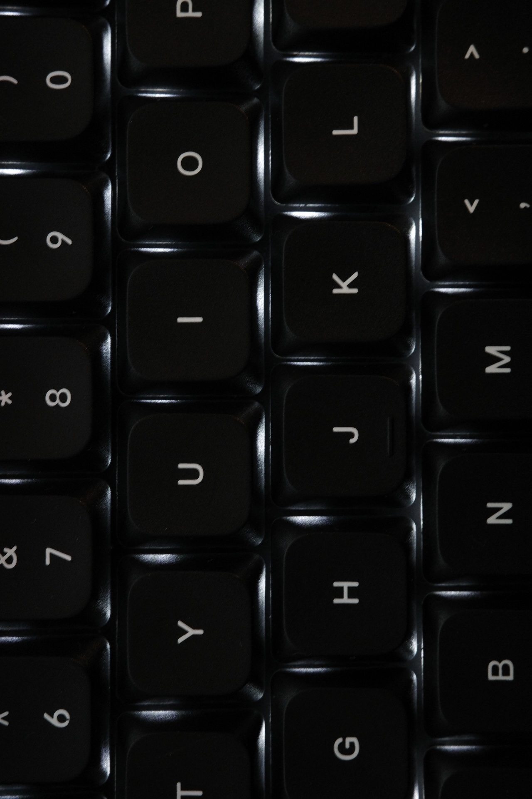

import RailM from '../../components/RailM.astro';
import RailFullM from '../../components/RailFullM.astro';
import ImgGrid from '../../components/ImgGrid.astro';

ここ数年キーボードが楽しい。ボタンを押すのって楽しい。  

## 今持っているキーボード  

### Keychron K3
<RailM>
  
</RailM>
最初に買ったメカニカルキーボード。  

Macの純正キーボードのストロークが浅くて疲れるのでキーボードを探していたが、当時はそれでもノーマルプロファイルを敬遠していた。ミニマルスタイリッシュな見た目に惹かれた。ストロークが短くても押した感が欲しくて青軸を選んだ。かなり音が大きい。外では使えない。  

### Keychron K2 Pro

<RailM>
  
</RailM>

ノーマルプロファイルの深いストロークが楽しいことに気付いて買った。アルミボディで重くて安定感がある。K3もそうだが、テンキーレス75%レイアウトは場所を取らずマウスとキーボードを頻繁に行き来する作業で活躍する。すっぽり長方形に収まってるレイアウトが綺麗で良い。  

カスタムも楽しい。静音スイッチに換装したので、Web会議の際も活躍してくれる。キーキャップも好みのものを見つけて変えたらこれが楽しくて仕方なくなった。  

### Nuphy Air60 v2

<RailM>
  
</RailM>

持ち運ぶために小さく、タイプ音が静かなものが欲しくて買った。見た目がかわいい。  

始めは赤軸だったが、もっと静かにしたくてサイレントスイッチに変更。これが静かなコトコト音で打ち心地がいい。タクタイルなのも好み。かなり静かでコンパクトなので職場や、出先でiPadで文字書く時に活躍してる。専用ケースがタブレットスタンドになるのはいいアイディアだと思う。持ち運び時の保護と作業環境作りをこれのみでこなす。めっちゃいい。  

ファンクションキーがない60%レイアウトはどうかと思ったけど慣れる。前述の二点と違い、エンターやバックスペースキーの隣にキーが無いのでミスタイプが少ない、気がする。  

### Keychron Q3 Pro SE

<RailM>
  
</RailM>

左側にノブが付いているキーボードをずっと探していた。ゴツくて機材感があってかっこいいと思いずっと欲しかったが高価で躊躇していたところをメルカリで格安の物をみつけて購入。ノブとマクロキーが簡易左手デバイスになり、特定のツールでの作業が楽になった。  

このQシリーズは何重にも重なった吸音フォームとガスケットマウントが気持ちいい打ち心地を提供してくれる。ここまで違うものなんだなぁって驚いた。奥が深い…。  

デフォルトで入っていたバナナ軸は重めで好み。しばらくはこれで楽しみたい。  

## 物理的インターフェース
物理ボタンはいくつになっても心が躍る。ボタンを押し、指先にリアルのフィードバックが返ってくる感覚はなぜあんなに楽しいのか。思えば小さい子供のころから皆ボタンを押すのが好きだ。本能的なものすら感じる。日常で触るほとんどのデバイスがタッチパネルに移行してきた現在、物理ボタンは逆に希少になってきたように思う。  

ボタン、ノブ、トグルスイッチ、つまみ…などなど物理UIは機械を操作するための原始的なインターフェースかつ超基本的な機能だ。それの名残はタッチデバイスにもわかりやすい形で残る。それでもまだ指先に帰属感として返ってくるフィードバックは再現できていない。  

物理的インターフェースを触る気持ちよさを体験したいがために、まだ使えもしない分野の機器を買おうと思うほどである。オーディオインターフェースなどは見ているだけで心が躍る。専門的、かつ機器を目視せずに使うシーンが想定される機器ほど、まだ物理インターフェースが多いように思う。オーディオやカメラなど…。  

手先で入力したいものを探せる、というのはタッチスクリーンにはない強みだ。昔ガラケーを使っていた頃は、画面を見ずとも待ち受け画面からメールを新規作成し、連絡先一覧から宛先を選択、本文を一通り入力する…みたいなことはしていたように思う。「歩きケータイ」なんて問題も聞かなかったように記憶している。それだけタッチUIは人間のリソースを食うのかもしれない。  

<RailFullM>
  
</RailFullM>

## 変わったこと
多分今となってはもっとも身近な物理ボタンデバイスがキーボードなのではと思う（職種にもよるが）。毎日触るものなので、テンション上がる物を使いたい。それに、お気に入りのキーボードがいくつかある状態のメリットもあり、それを触るために仕事以外でもデスクに座る習慣ができたことだ。デスクに座ると、何だかんだで考えていることをタイプしたり、コード書いたり、デザインしたりでアウトプットするので、これはいい変化だったんじゃないかと思う。  

しかし気質によるが、メカニカルキーボードのように部品を買って使い心地を自分で好きにカスタムできるものは本当に危険だ。キリがなく色々試したくなってしまう。  

次は自作キットを買ってみたい。  