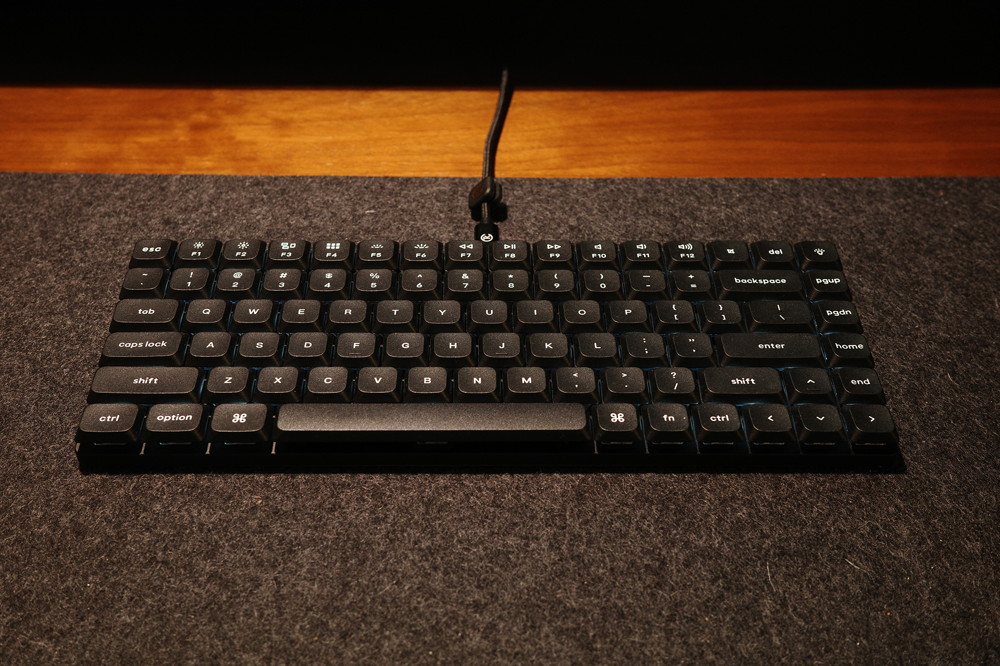
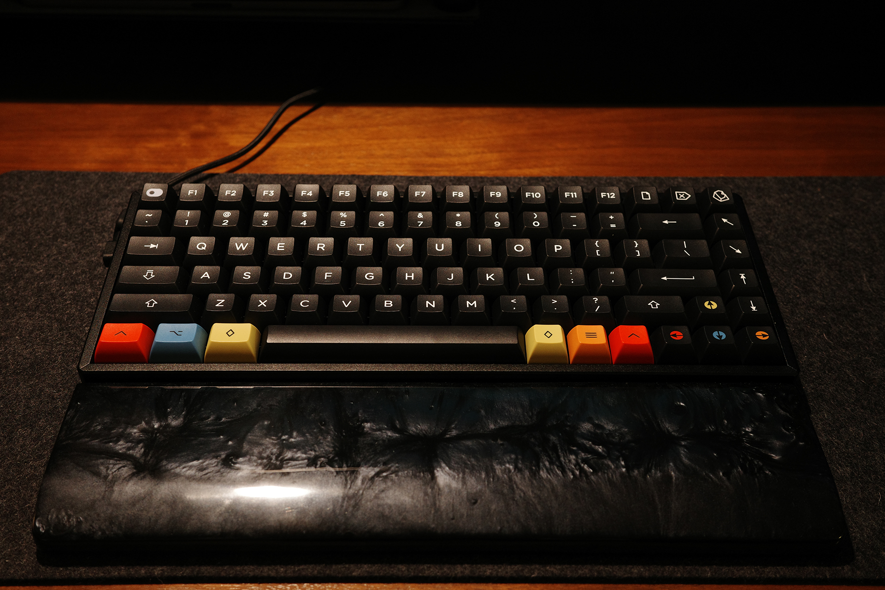
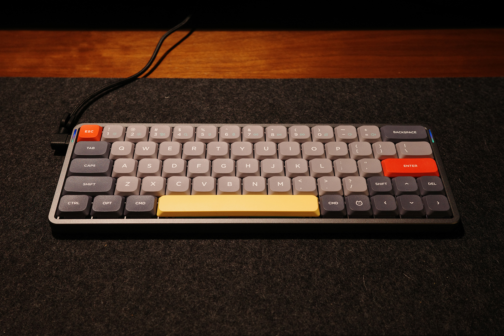
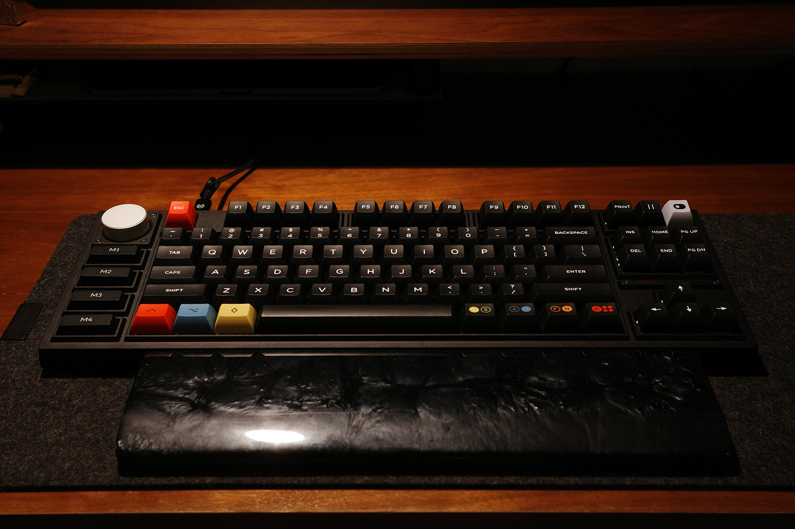
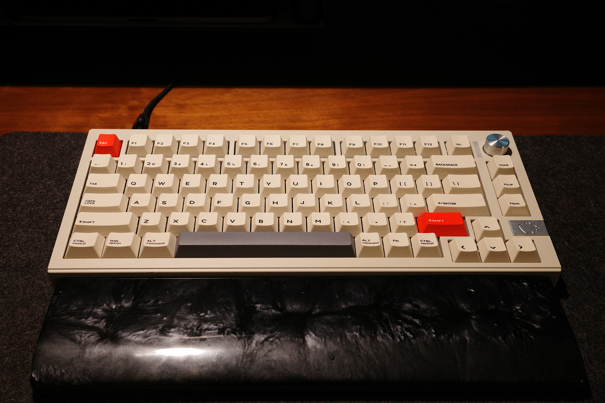
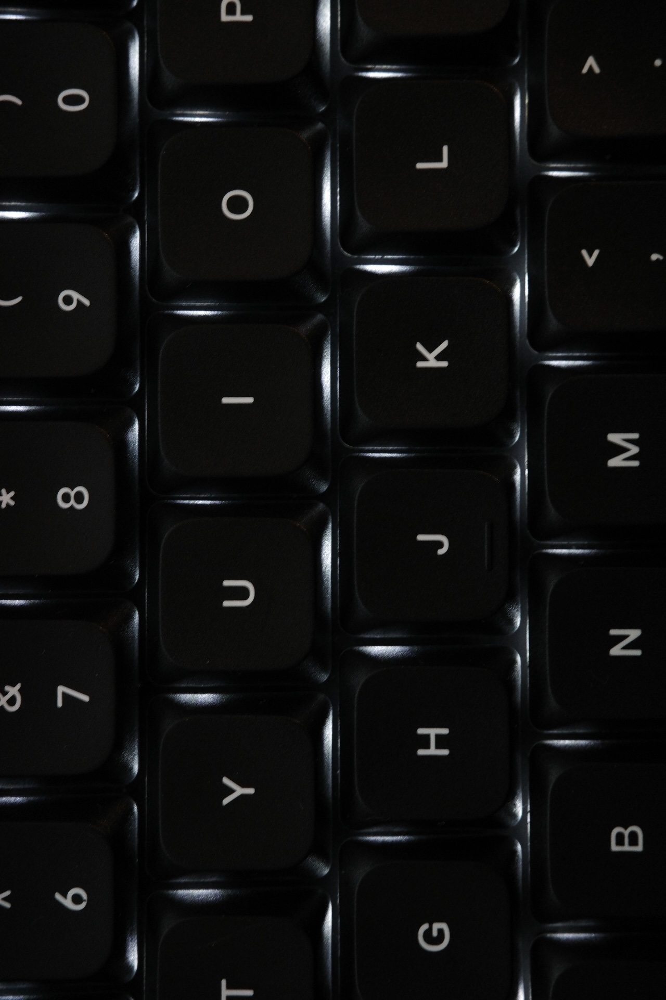

import RailM from '../../components/RailM.astro';
import RailFullM from '../../components/RailFullM.astro';
import ImgGrid from '../../components/ImgGrid.astro';

ここ数年キーボードが楽しい。ボタンを押すのは楽しい。  

学生時代から長いことMac純正品やMacbookに備え付けられたキーボードばかり使っていたが、リモートワークが始まりデスクの環境を整え始めた頃に自分でも驚くほどハマった。「さまざまな部品を組み合わせて自分好みにカスタム」ができるものに弱いのは小さな頃から変わらない。それが日常的に長い時間触る物だとなおさららしい。  

自分が今使っているものを自慢しつつ、楽しさを分解する。  

## 今持っているキーボード  

### Keychron K3
  

最初に買ったメカニカルキーボード。  

Macの純正キーボードをリモートで使い続けるうちになんか疲れるなと思っていた。調べるとどうやら私はタイプする時の力がかなり強いらしく、それとキーストロークが浅いMacのキーボードは相性が悪いみたいだったので、疲れないキーボードを探していた。だが、当時はそれでも普通のキーボードより薄い方が良いと思っていて、ミニマルスタイリッシュな見た目に惹かれたこれを買った。スイッチが選べるというのも初めてで、薄くても押した感がほしいなぁと思って押し味が重くてカチカチ鳴るいわゆる青軸を選んだ。  

結果としてはだいぶ楽なった。と同時に久しく忘れていた、本来のキーボードらしい「ボタンを押してる〜」という感触が楽しいなと思った。  

しかしかなり音が大きい。外出先では使いにくい大きさの音だが、当時はコロナ禍真っ只中だったのであまり関係なかった。軽くて取り回しがよく、今でもたまにカチカチタイピングして気持ちよくなっている。  

### Keychron K2 Pro

  

きっかけは忘れたが、よりストロークの長いキーボードがかっこよく思えてきて買った。K3と比べると重めで安定感がある。K3もそうだが、テンキーレス75%コンパクトレイアウトはMacbookの配列に近く、場所を取らないし使いやすくていい。すっぽり長方形に収まってるレイアウトも綺麗だ。視覚栄養価が高い（好みによる）。  

このノーマルプロファイルの長いストロークが、子供の頃に触っていたパソコンを思い出させてなんか良かったのを覚えている。ただその頃のキーボードと違うのは、スイッチやキャップの規格がある程度統一されていて、比較的簡単に換装できるとこだ。これを知ってキーキャップやスイッチを見た目や重さが良さそうなものに交換してみて、驚くほど打ち心地が変わったのがきっかけですっかりカスタムキーボードにハマった。  

### Nuphy Air60 v2

  

持ち運ぶために小さく、タイプ音が静かなものが欲しくて買った。見た目がかわいい。  

買った時点では赤軸だったが、もっと静かにしたくてサイレントスイッチに変更。これが静かなコトコト音で打ち心地がいい。ロープロファイルかつファンクションキーがない60%レイアウトは手持ちの中でも最小で、タイプ音もかなり静かなので職場や、出先でiPadで文字書く時に活躍してる。専用ケースがタブレットスタンドになるのはいいアイディアだと思う。持ち運び時の保護と作業環境作りをこれのみでこなす。めっちゃいい。  

本来最上段にあるファンクションキー無いのは不便かなぁと思ったけど慣れる。前述の二点と違い、エンターキーの隣にキーが無いのでミスタイプが少ない、気がする。  

### Keychron Q3 Pro SE

  

最近もっとデザインやコーディング作業を楽にしたくて左側にノブが付いているキーボードをずっと探していた中で見つけたもの。ゴツくて高度な機材っぽさがかっこいいと思いずっと欲しかったが高価で躊躇していたところをメルカリで格安で出品されている物をみつけて購入。ノブとマクロキーが簡易左手デバイスになり、特定のツールでの作業が楽になった。  

このQシリーズは何重にも重なった吸音フォームとガスケットマウントが気持ちいい打ち心地を提供してくれる。スイッチだけじゃないんだ...中の構造でもここまで違うものなんだ...って驚いた。奥深さ...というかキーボードの沼の深さを感じた。  

デフォルトで入っていたバナナ軸が重めですごく好み。しばらくはこれで楽しみたい。  

### CIDOO V75 PRO  
  

もう日頃からキーボード関連の情報を漁るようになっている中でふと目についたキーボード。懐かしさを感じるルックスがとてもよくてずっと気になっていたところ、ヤフオクで１円スタートだったものを見つけて購入。定価よりもすごく安く買えたので大丈夫か不安だったが杞憂だった。  

オールアルミの筐体でずっしり重く、キーキャップが他と比べると明らかに分厚い。すごくガッシリした印象を受ける。それらのおかげか、打つとコトコトとクリーミーな音がし、スペースのような横に長いキーも全くブレずに返ってくる時にバコバコ音がしない。これがとっても気持ち良い。最近家でテキストを書く時はこればかり使っている。それくらい長時間触っていたい魅力がある。これは色々弄る気にならない、完成されたタイプのキーボードだった。  

## 指先で触れる、押す、回す  
物理ボタンはいくつになっても心が躍る。ボタンを押し、指先にリアルのフィードバックが返ってくる感覚はなぜあんなに楽しいのか。バスの停車ボタン...駅の券売機のボタン...などあらゆる「決定」を下すボタンを自分で押したくてせがんだ頃を思い出すと、小さい子供のころから皆ボタンを押すのが好きだ。本能的なものすら感じる。日常で触るほとんどのデバイスがタッチパネルに移行してきた現在、物理ボタンは逆に希少になってきたように思う。  

ボタン、ノブ、トグルスイッチ、つまみ…などなど物理UIは機械を操作するための原始的なインターフェースかつ超基本的な機能だ。それの名残はタッチデバイスのUIコンポーネントにもわかりやすい形で残る。それでもまだ指先に返ってくるフィードバックは再現できていない。  

  

物理的インターフェースを触る気持ちよさを体験したいがために、まだ使えもしない分野の機器を買おうと思うほどである。音楽制作におけるシンセサイザーやシーケンサー、ミキサーなどは見ているだけで心が躍る。専門的、かつ機器を目視せずに使うシーンが想定される機器ほど物理インターフェースが多いように思う。オーディオやカメラ、車やオートバイの一部もそうだ。  

触感で入力したいものを探せる、というのはタッチスクリーンにはない強みだ。昔ガラケーを使っていた頃は、画面を見ずとも待ち受け画面からメールを新規作成し、連絡先一覧から宛先を選択、本文を一通り入力する…みたいなことはしていたように思う。「歩きケータイ」なんて問題も聞かなかったように記憶している。それだけタッチUIは人間のリソースを食うのかもしれない。  

夢物語だが、もしタッチデバイスで物理インターフェースのような身体的フィードバックが再現できるようになったら、それはとても素晴らしい革命かもしれないと思う。単に技術的にすごいかどうかにとどまらず、マウスから始まったデジタルに対する自己帰属感はより深くなり、機械と人間の付き合いはより親密になる気がする。  

## 変わったこと
多分今となってはもっとも身近な物理ボタンデバイスがキーボードなのではと思う（職種にもよるが）。毎日触るものなので、テンション上がる物を使いたい。それに、お気に入りのキーボードがいくつかある状態のメリットもあり、それを触るために仕事以外でもデスクに座る習慣ができたことだ。デスクに座ると、何だかんだで考えていることをタイプしたり、コード書いたり、デザインしたりでアウトプットするので、これはいい変化だったんじゃないかと思う。  

気質によるが、「さまざまな部品を組み合わせて自分好みにカスタム」できるものは本当に危険だ。キリがなく色々試したくなってしまう。  

次は自作キットを買ってみたい。  