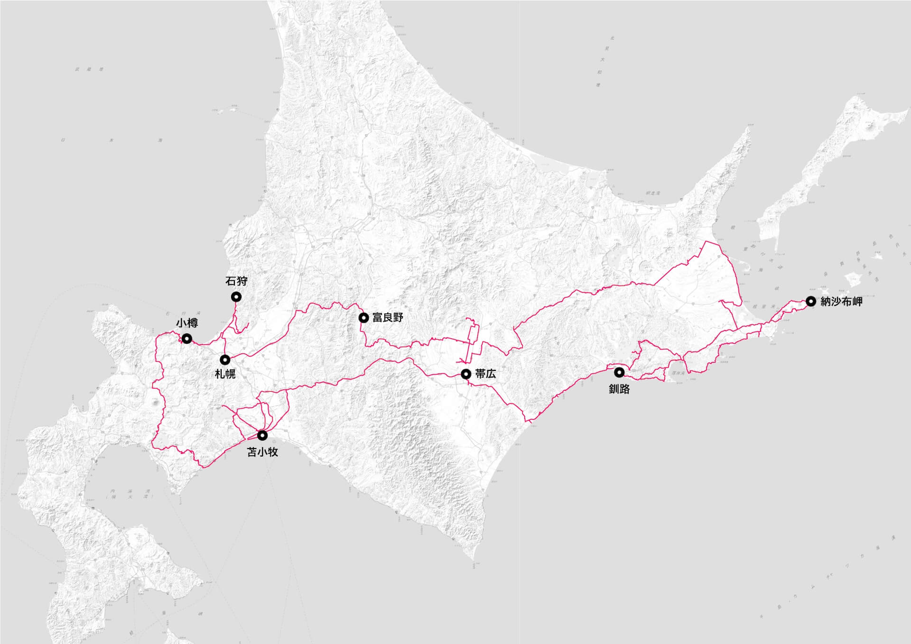
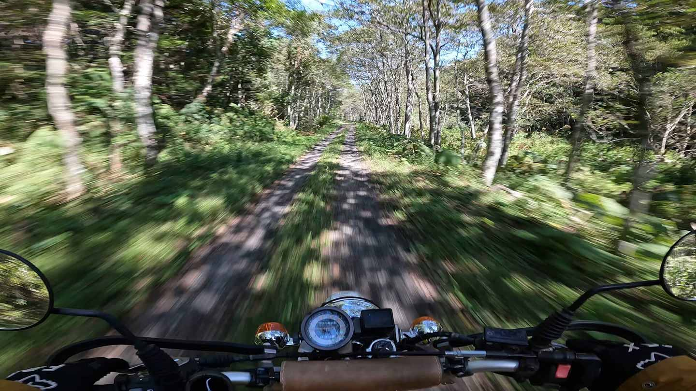
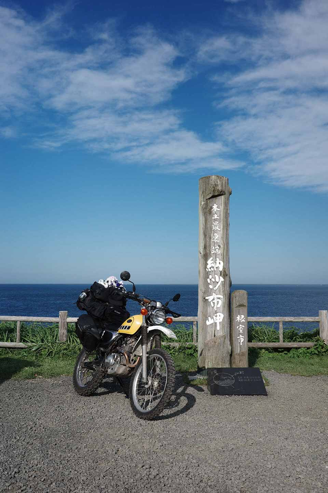

import RailM from '../../components/RailM.astro';
import RailFullM from '../../components/RailFullM.astro';
import ImgGrid from '../../components/ImgGrid.astro';
import Img from '../../components/Img.astro';
import Ai2html from '../../components/Ai2html.astro';
export const components = {img: Img}

import routeSp from '../../assets/blog/202411hokkaido/route-small.jpg';
import routePc from '../../assets/blog/202411hokkaido/route-large.jpg';

今年も北海道へ行った。今年は昨年行けなかったところを回るついでに、林道も走りたかったのでオフロードバイクで行った。  

昨年は完全に北海道の広大さを舐めていた結果、結構無理したルートになってしまったが、今回は二回目と言うこともありそれなり余裕のあるルート設定をできた。昨年より滞在期間が長かったのもあり、たっぷり北海道の自然を楽しむことができた。  
<RailM>
  {/* 
  
今回走ったルート。総走行距離約2400km。出典：国土地理院
 */}
  <figure class="c-media">
  <Ai2html
    css='g-route-box ,
	#g-route-box .g-artboard {
		margin:0 auto;
    font-family: sans-serif;
	}
	#g-route-box .g-artboard {
		display: none;
	}
	#g-route-box {
		contain: content;
		container-type: inline-size;
	}
	#g-route-box p {
		margin:0;
	}
	#g-route-box .g-aiAbs {
		position:absolute;
	}
	#g-route-box .g-aiImg {
		position:absolute;
		top:0;
		display:block;
		width:100% !important;
	}
	#g-route-box .g-aiSymbol {
		position: absolute;
		box-sizing: border-box;
	}
	#g-route-box .g-aiPointText p { white-space: nowrap; }
	#g-route-large {
		position:relative;
		overflow:hidden;
	}
	#g-route-large p {
		font-weight:regular;
		line-height:14px;
		height:auto;
		opacity:1;
		letter-spacing:0em;
		font-size:12px;
		text-align:left;
		color:rgb(0,0,0);
		text-transform:none;
		padding-bottom:0;
		padding-top:0;
		mix-blend-mode:normal;
		font-style:normal;
		position:static;
		text-stroke:initial;
		-webkit-text-stroke:initial;
		-moz-text-stroke:initial;
		paint-order:normal;
		text-shadow:initial;
		filter:none;
	}
	#g-route-large .g-p0 {
		font-weight:700;
		height:14px;
		text-align:center;
	}
	#g-route-large .g-p1 {
		font-weight:700;
		height:14px;
	}
	@container (min-width: 768px) {
		.g-artboard#g-route-large { display: block; }
	}
	#g-route-small {
		position:relative;
		overflow:hidden;
	}
	#g-route-small p {
		font-weight:regular;
		line-height:12px;
		height:auto;
		opacity:1;
		letter-spacing:0em;
		font-size:10px;
		text-align:left;
		color:rgb(0,0,0);
		text-transform:none;
		padding-bottom:0;
		padding-top:0;
		mix-blend-mode:normal;
		font-style:normal;
		position:static;
		text-stroke:initial;
		-webkit-text-stroke:initial;
		-moz-text-stroke:initial;
		paint-order:normal;
		text-shadow:initial;
		filter:none;
	}
	#g-route-small .g-p0 {
		font-weight:700;
		height:12px;
		text-align:center;
	}
	#g-route-small .g-p1 {
		font-weight:700;
		height:12px;
	}
	#g-route-small .g-p2 {
		font-weight:700;
		height:12px;
		text-align:right;
	}
	@container (max-width: 767px) {
		.g-artboard#g-route-small { display: block; }
	}'>
  

    {/* <!-- Artboard: large --> */}
    

      

      
      

        
石狩

      

      

        
納沙布岬

      

      

        
富良野

      

      

        
小樽

      

      

        
帯広

      

      

        
札幌

      

      

        
釧路

      

      

        
苫小牧

      

    

    {/* <!-- Artboard: small --> */}
    

      

      
      

        
石狩

      

      

        
納沙布岬

      

      

        
小樽

      

      

        
富良野

      

      

        
札幌

      

      

        
帯広

      

      

        
釧路

      

      

        
苫小牧

      

    

  

  </Ai2html>
  <figcaption class="t-caption">今回走ったルート。総走行距離約2400km。出典：国土地理院</figcaption>

  </figure>
</RailM>

## 素晴らしき道東  
<RailFullM>
  
  
広大な草原を貫くダートを走る。

</RailFullM>
今回、昨年に十分に散策できなかった道東、中でもその南部を中心としたエリアを走れて本当に良かった。主に釧路湿原からその東側、北太平洋シーサイドライン周辺から納沙布岬までの区間。海と森と湿原などの多様な自然、そしてそれに人間の生活のための人工物が絡む素晴らしい景色ばかりだった。  

そして楽しみにしていた北海道の林道。それは本州のそれとはかなり様子が異なるものだった。群生する樹木や草花はもちろん、ほとんどが丘陵地形の中の道でありアップダウンが少なく見通しがよい。本州の林道のほとんどは山間部なので、走りやすさも景色も大きく異なる物だった。美しい白樺に囲まれた真っ直ぐなダート、広い草原に囲まれたゆるい丘陵ダート、これらを走る体験は本州ではなかなか味わえない良い体験だった。オンロードバイクでは見ることができない景色が見れるのがオフロードバイクの良さだ。未舗装路の多い北海道では多いに役立った。  

白樺に囲まれて走る美しい林道。

フレシマ湿原。海に向かって広大な湿原を走る。

## 出会った人たち  
今回は昨年よりも多くの人たちと話をすることができた。  

北海道はオートバイで旅する人の多い土地だ。だからなのか、地元の人たちは一様にみな暖かく接してくれる。キャンプ場や飲食店のオーナー、そこを利用する人々、道の駅で出会った地元の老夫婦、公衆浴場で話した人々、同じように北海道を旅する人たち。皆一様に旅人に優しい。彼らのおかけで見ることができたものや味わうことができたものも多い。  

昨年飛び入りで参加したハスクバーナモーターサイクルミーティングで出会った人たちにも今年も歓迎してもらえた。とても嬉しいことだ。  

次からは旅先で出会った人たちの写真をのこそうと思う。  

今年参加したハスクバーナミーティングの様子

## 住む人々と旅人  
他にも、彼らは地元の行政や公的人事に関心が強いと感じた。老若男女問わず一様にそうだと感じた。これは町長や市長や議会に参加している人との距離の近さに起因するものなのかもしれない。皆行政に参加している当事者と顔見知りなのだ。これはコミュニティの小ささという要因もあるかもしれないが、生活において町内で協力をする機会が多かったりすることが要因なのかもしれない。そこに良し悪しはあれど、政治に対する関心が皆高いのは感心する。  

また、北海道はその広大な土地に起因するのか、人工密集地同士の距離がある。そのため、人工が流出し高齢化が進む地域では行政やボランティアによる生活のサポートに力を入れているようだった。また、人工減対策には苦慮しているようで、各町村の資料に雇用の創出や新規の事業への投資をしようという姿勢が見られる。  

豊頃町のコンビニに貼られていたポスター。高齢者家庭に向けた買い物配達サポートについて書かれている。

ツーリングライダーなんて趣味は地方が元気であってこそのもの。少なくとも訪れた場所で積極的にお金を使うべきだと思うところだ。  

## 年一の長旅を終えて  
私は自然が作る美しい景色を見るためにオートバイに乗っているという部分がかなり大きい。スケールの大きさでは関東から1日で行ける距離圏では満足できなくなってきてしまっている。  

<RailM>
  <ImgGrid>
    
    
    

    
    
    

    

    

    

    
  </ImgGrid>
</RailM>

次はどこに行こうか。また北海道も何度でも再訪したいが、まだ未到の四国や、カルデラ特有のこれまた美しい自然を持つ九州・阿蘇も行ってみたい。  

